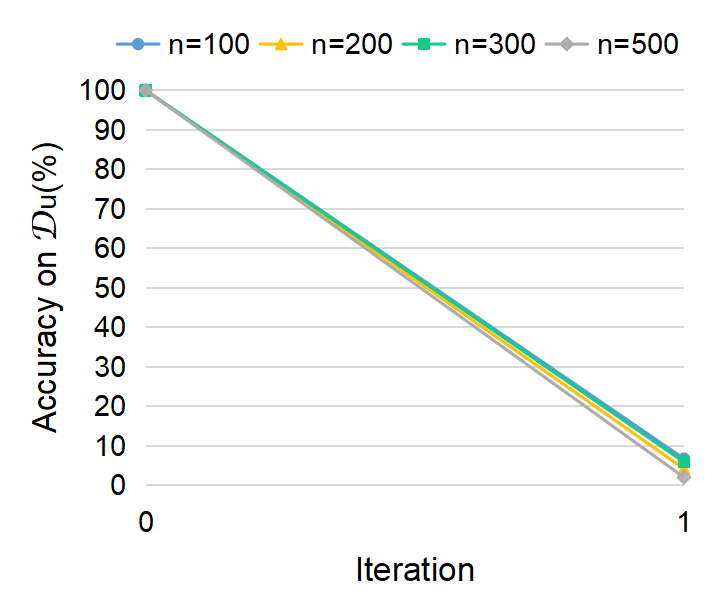
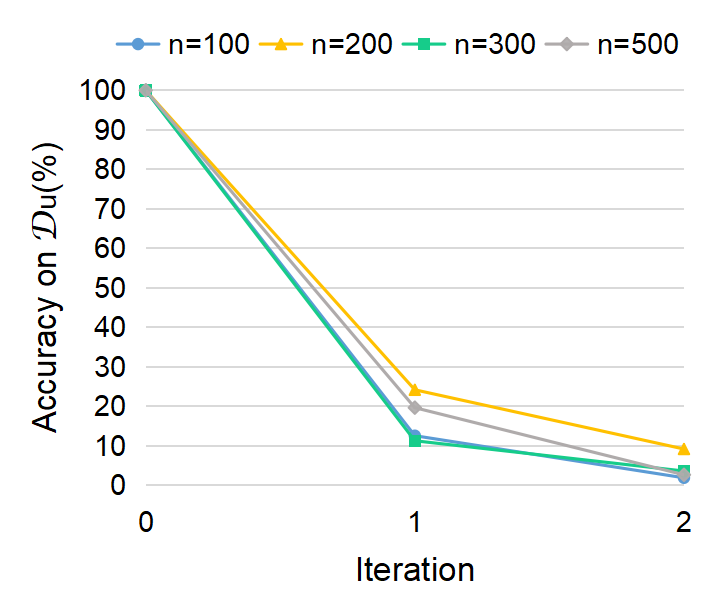
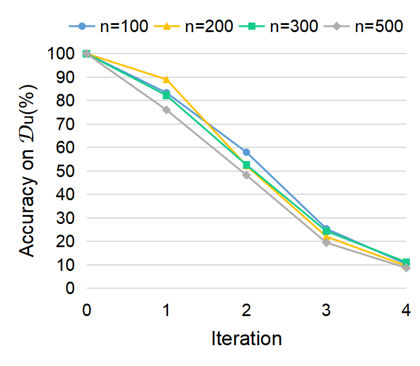

# Hyperparameter
The experimental results of $\mathcal{D}_U$ scale adjustment on the Purchase, Fashion-MNIST and CIFAR-10 datasets are shown in figures. On the first two datasets, PRUNE reaches convergence more quickly. The effect of $\mathcal{D}_U$ scale on the convergence of PRUNE is not significant. The CIFAR-10 dataset also has a limited effect of $\mathcal{D}_U$ scale due to the more complex model. However, their overall trends are consistent with the other two datasets. Larger scale tends to imply faster convergence.

