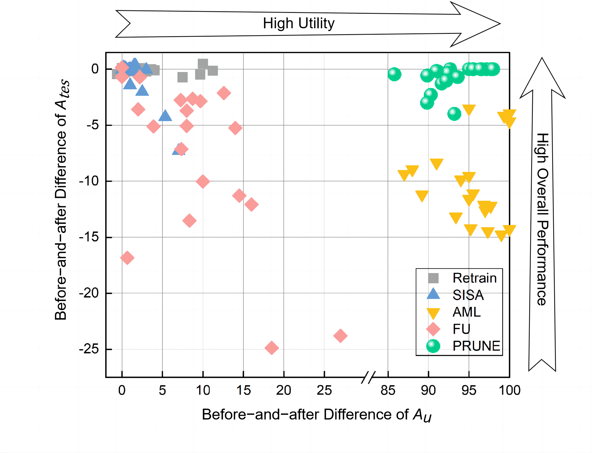

# Comparison
To more visually represent the experimental results in Utility Guarantee, we plotted the scatter plot. Using the difference in $A_{tes}$ before and after the execution of the algorithms as the $y$ axis and the difference in $A_u$ before and after the execution of the algorithms as the $x$ axis, we plotted the results of the five algorithms on the five datasets for different sizes of unlearning data as scatter plots. The more points representing each of the unlearning mechanisms are concentrated in the upper right corner, the better the mechanism is in the two dimensions of erasure effectiveness and overall performance. As the figure shows, PRUNE is the unlearning mechanism that best meets both the requirements of erasing data points and maintaining model performance. It is able to accurately unlearn for some given data points with essentially no interference to the output results of other data points. Our approach provides auditors with possible evidence for review without creating a conflict of interest with the model owner.

