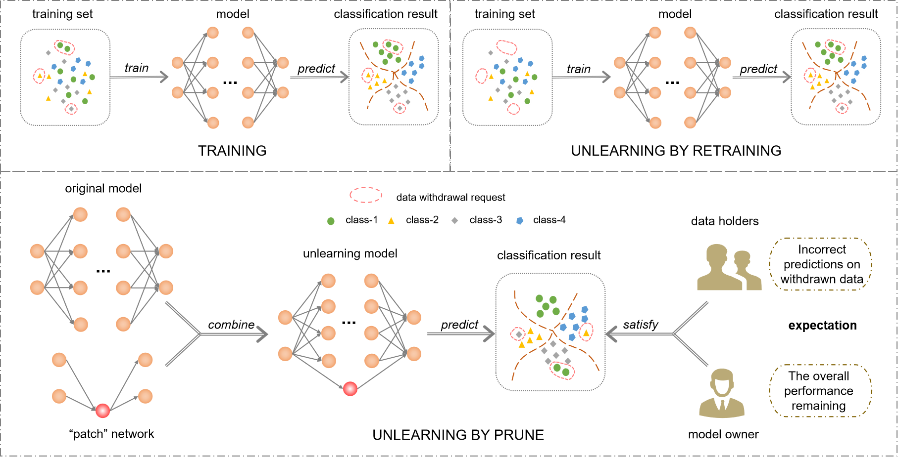

# PRUNE2023
For the machine unlearning problem, we take a new angle and propose a novel unlearning approach by imposing carefully crafted targeted ‘patch’ on the original neural network to achieve ‘forgetting’ of the requested data to delete. Specifically, inspired by the research line of neuron network repair, we propose to strategically seek a minimum ‘patch’ for unlearning a given data point with provable guarantee. Furthermore, to unlearn a larger amount of data points (or an entire class), we propose to iteratively select a small set of representative data points to unlearn, which however achieves the effect of unlearning the whole set.



## Process of Using PRUNE to Unlearn

1.Randomly select data points in the training set to simulate data withdrawal requests

2.Clustering of data points to unlearn is performed to select representative data points.(No clustering if class unlearning.)

3.Generate patch networks for these representative points to confound the model predictions for these data points.

## How to start quickly 
To make it easy for you to run our experiments in our paper, we provide sample code to perform multi-point unlearning on the Purchase dataset. The dataset extracted from Kaggle: Acquire Valued Shoppers Challenge. And we randomly picked 20 categories and uploaded the processed data. Please install the necessary packages before running.
```
pip install -r requirements.txt
```
This work is tested with Python 3.8.15. 

## References
```
@inproceedings{
fu2022sound,
title={Sound and Complete Neural Network Repair with Minimality and Locality Guarantees},
author={Feisi Fu and Wenchao Li},
booktitle={International Conference on Learning Representations},
year={2022},
url={https://openreview.net/forum?id=xS8AMYiEav3}
}
```
